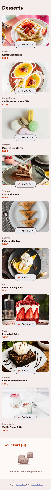
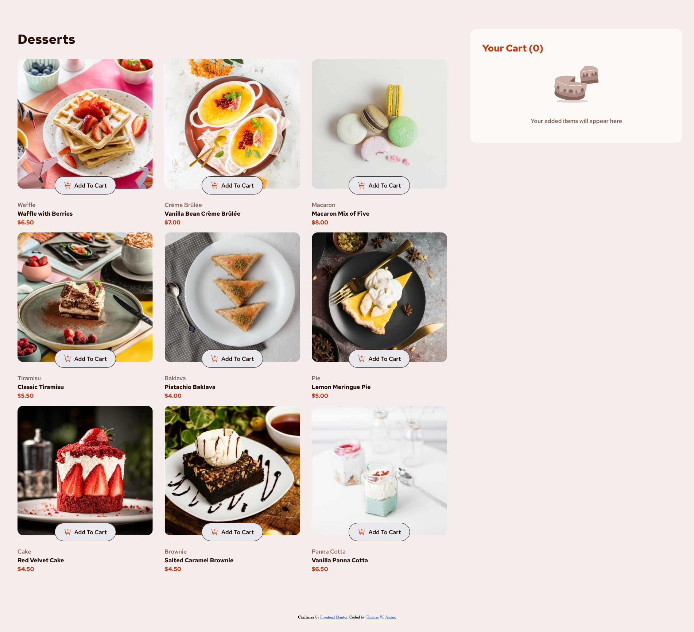

# Frontend Mentor - Product list with cart solution

This is a solution to the [Product list with cart challenge on Frontend Mentor](https://www.frontendmentor.io/challenges/product-list-with-cart-5MmqLVAp_d). Frontend Mentor challenges help you improve your coding skills by building realistic projects. 

## Table of contents

- [Overview](#overview)
  - [The challenge](#the-challenge)
  - [Screenshot](#screenshot)
  - [Links](#links)
- [My process](#my-process)
  - [Built with](#built-with)
  - [What I learned](#what-i-learned)
- [Author](#author)
- [Acknowledgments](#acknowledgments)

## Overview

### The challenge

Users should be able to:

- Add items to the cart and remove them
- Increase/decrease the number of items in the cart
- See an order confirmation modal when they click "Confirm Order"
- Reset their selections when they click "Start New Order"
- View the optimal layout for the interface depending on their device's screen size
- See hover and focus states for all interactive elements on the page

### Screenshot





### Links

- Solution URL: [https://github.com/turtlethom/product-list-with-cart-main](https://github.com/turtlethom/product-list-with-cart-main)

- Live Site URL: [https://turtlethom.github.io/product-list-with-cart-main/](https://turtlethom.github.io/product-list-with-cart-main/)

## My process

### Built with

- Vanilla JavaScript w/ JS Doc 3
- Semantic HTML5 markup
- CSS custom properties
- Flexbox
- CSS Grid

### What I learned

#### Manipulating The DOM
This project taught me a substantial amount on designing a website that has a flexible and extensible design. It was an interesting challenge creating a uniform grid template for 'n' amount of products.

I had to force myself to use quite a bit of Vanilla JS which I have never done before to this extent.

While other challenges have helped me develop my skills in HTML and CSS, this challenge had a very strong emphasis on understanding the fundamentals of Vanilla JS.

These are my key takeaways:
- `id` and `class` are great for identifying and selecting groups of elements, reducing redundant code.
- `<svg>` can be created using `document.createElementNS();`.
- The `<dialog>` element has a special method called `showModal()`.

#### Working With SVGs

In order to add custom CSS state styling to custom SVGs, I had to implement the SVGS in JavaScript themselves. This was by far the most time consuming aspect of this project, as I had to learn how to recreate the SVGs within the document themselves using JS.

If I did not, I would not have been able to achieve the CSS styling on certain states (hover and focus) for these custom SVGs.

```js
function createDecrementSVG(baseFill) {
    const svg = document.createElementNS('http://www.w3.org/2000/svg', 'svg');
    svg.setAttribute('width','10');
    svg.setAttribute('height', '2');
    svg.setAttribute('fill', 'none');
    svg.setAttribute('viewBox', '0 0 10 2');

    const path = document.createElementNS('http://www.w3.org/2000/svg', 'path');
    path.setAttribute('fill', baseFill);
    path.setAttribute('d', 'M0 .375h10v1.25H0V.375Z');

    svg.appendChild(path);
    svg.classList.add('centered');

    return { svg, path };
}
 ```

This is an example of the solution I came up for creating SVG's dynamically to manipulate the `fill` attributes of each individual SVG.

#### Utilizing CSS Grid's `minmax()` function
```css 
#product-grid {
  --repeat: 3;
  display: grid;
  grid-template-columns: repeat(var(--repeat, auto-fit), minmax(175px, 1fr));
  column-gap: 2rem;
  padding: 1rem;
}
```

I used the `minmax` function in combination with local CSS properties to design the product grid dynamically. Using the `--repeat` variable in media queries have aided in avoiding writing more code for different viewport sizes.

## Author

- Frontend Mentor - [@turtlethom](https://www.frontendmentor.io/profile/turtlethom)
- Twitter - [@wjamesthomas3](https://www.twitter.com/wjamesthomas3)

## Acknowledgments

My friend Alex that I met on Frontend Mentor has been incredibly helpful in providing me various tips and resources to improve my skills as an overall developer.

I am thankful for all of his advice and recommendations.
- https://www.frontendmentor.io/profile/Alex-Archer-I